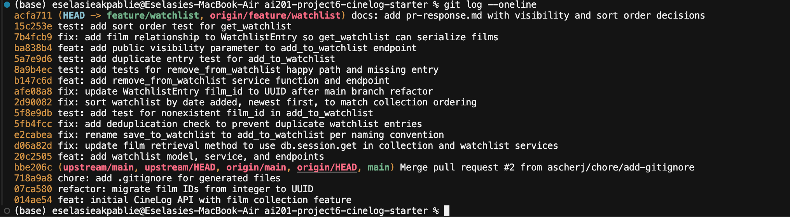

# PR Response Doc — CineLog Watchlist Feature

## AI Usage

I used Claude Code (Anthropic) throughout this project:

- **Codebase orientation:** I had it summarize `models.py`, `services/collection_service.py`, and `tests/test_collection.py` before reading the review comments, so I understood the `verb_to_noun` naming convention, the `AlreadyInCollectionError` deduplication pattern, and the fixture structure the tests share.
- **Implementation and verification:** It helped implement the review fixes and ran the verification loop after each change (project-wide grep for stale references, full `pytest` runs, and a live `curl` smoke test of every endpoint). That smoke test caught a latent bug the review hadn't: `get_watchlist()` crashed with a 500 because `WatchlistEntry` had no `film` relationship (see "Additional fix" below).
- **Stress-testing the design arguments:** I used it as a devil's advocate on my Comment 4 and Comment 5 drafts. The main thing that changed as a result: my Comment 4 response originally leaned only on "discovery is good for the community"; the counterargument that streaming-service queues (the closest analogy users have) are private pushed me to ground the argument in what CineLog *already* exposes (collections and ratings have no privacy flag at all) and to acknowledge the expectation mismatch explicitly.


## Comment 1 — Rename

**What I did:** Renamed `save_to_watchlist()` to `add_to_watchlist()` in `services/watchlist_service.py` to match the project's `verb_to_noun` convention (`add_to_collection()`, `remove_from_collection()`, `get_collection()`), and updated its docstring from "Save a film" to "Add a film."

**How I verified:** I found all call sites with a project-wide search (`grep -rn "save_to_watchlist" --include='*.py' .`) before editing. There were three hits: the definition, plus an import and a call in `routes/watchlist/watchlist.py`. After the rename I re-ran the same grep (zero results) and ran the full test suite (`pytest tests/ -v`), which passed.

## Comment 2 — Deduplication

**What I did:** Added a duplicate check to `add_to_watchlist()` modeled directly on how `add_to_collection()` in `services/collection_service.py` handles the same case: after confirming the film exists, query `WatchlistEntry.query.filter_by(user_id=..., film_id=...).first()`, and if an entry already exists, raise a new `AlreadyOnWatchlistError` instead of inserting a second row. The collection service defines `AlreadyInCollectionError` for exactly this, so I mirrored both the exception naming and the check placement. I also updated the route to translate errors into HTTP statuses the way `routes/collection.py` does: `AlreadyOnWatchlistError` → 409 Conflict, and `FilmNotFoundError` → 404 (previously the watchlist route let that exception escape as a 500).

**How I verified:** Wrote `test_add_to_watchlist_duplicate_raises` (add the same film twice, assert the exception and that exactly one row exists), and confirmed live with curl: the first `POST /watchlist/<user_id>/add` returned 201, the identical second request returned 409 with an error message.

## Comment 3 — Missing test

**What I did:** Created `tests/test_watchlist.py` with `test_add_to_watchlist_nonexistent_film_raises`, modeled on `test_add_to_collection_nonexistent_film_raises` in `tests/test_collection.py`. It follows the same structure: the same `app` / `sample_user` fixtures (in-memory SQLite, isolated per test), a fake UUID film id (`"00000000-0000-0000-0000-000000000000"`), and a `pytest.raises(FilmNotFoundError)` assertion — the point being that a bad film id raises the domain error, not a database integrity error.

**How I verified:** `pytest tests/test_watchlist.py -v` passes, and the full suite (`pytest tests/ -v`) passes alongside the existing collection tests.

## Comment 4 — Default visibility

**My position:** Keep `public=True` as the default — but make it an explicit, documented decision (this note) rather than an inherited one, and pair it with a way for callers to opt out (the `public` parameter added to the add endpoint in this PR).

**Reasoning:** CineLog's README defines the product as "a community film tracking app" — the core loop is social: users log films, rate them, and build collections that other people can browse. Two things about CineLog specifically push me to public-by-default:

1. **It matches what the platform already exposes.** Collections — the app's primary feature — have no visibility flag at all: `GET /collection/<user_id>` returns any user's watched films and ratings unconditionally. A watchlist entry ("I intend to watch this") is strictly less sensitive than a rating history ("I watched this and gave it 2/5"). Defaulting the less sensitive data to private while the more sensitive data is always public would be an incoherent privacy model; if we believe user lists need privacy, the right fix is a visibility system across both features, not a quiet private default on one of them.
2. **Defaults determine whether the community feature works at all.** Watchlists are CineLog's best signal for "what is this community planning to watch." Most users never change defaults, so a private default effectively kills watchlist-based discovery for the whole platform, not just for privacy-conscious users.

**Tradeoff acknowledged:** Private-by-default optimizes for user trust and safety-by-default — no one is ever surprised to find their queue visible, which matters because the closest analogies users bring with them (Netflix/streaming queues) are private. That's a real cost of my choice: some users will assume privacy they don't have. I think it's the right trade for CineLog because the exposed data is low-stakes (film titles, not personal content), the per-entry `public` column and the new `public` request parameter give users an opt-out, and the alternative undermines the community premise of the product. If CineLog ever surfaces watchlists more aggressively (e.g., in feeds or notifications), the default should be revisited alongside a proper account-level privacy setting.

## Comment 5 — Sort order

**My position:** Agree with the maintainer — I changed `get_watchlist()` to sort by `date_added` descending (newest first) and added a test pinning that order.

**Reasoning:** A watchlist is a queue of intent, and both ways people use a queue are date-based: "what did I just add" (newest end) and "what's been sitting here the longest" (oldest end). A date-sorted list serves both — the oldest items are simply the other end of the same ordering. Alphabetical order serves neither browsing intent; the only task it helps is looking up a specific title, and that's a lookup problem better solved by filtering (the films endpoint already supports query-param filters, and a `?sort=`/`?title=` parameter can be added to the watchlist later if a client needs it). There's also a codebase-consistency argument: `get_collection()` already returns newest-first (`order_by(CollectionEntry.date_added.desc())`), and the README documents that behavior — with date-added, the two list endpoints in the API share one mental model, and my implementation mirrors the collection service line-for-line.

**Engagement with reviewer's point:** The maintainer's claim was "most users want to see what they added recently." I agree, and the existing `get_collection()` behavior suggests the project already made this call once for the same kind of list. The community reviewer on the thread raised the complementary case — wanting to reach the *oldest* watchlist entry to finally watch it — and that case also favors date ordering over alphabetical, since alphabetical order buries "longest waiting" entirely. I considered proposing a `?sort=` query parameter as a synthesis, but I'd defer it: it grows the API surface for a preference nobody has asked for yet, and the default would still need to be date-added for the reasons above.

## Comment 6 — Rebase

**What conflicted:** While this PR was open, `main` took a refactor migrating film IDs from integers to UUIDs (`Film.id` and `CollectionEntry.film_id` became `String(36)` UUIDs, and `models.py` on main no longer contained the `WatchlistEntry` model at all). My branch's watchlist code still assumed integer film IDs. `git rebase origin/main` completed without a *textual* conflict (my commits didn't touch the same lines the refactor did), but it left the branch semantically broken: the entire test suite failed at import with `ImportError: cannot import name 'WatchlistEntry' from 'models'`, and the service docstrings/route docs still said `film_id` was an int.

**How I resolved it:** After the rebase, I restored the `WatchlistEntry` model in `models.py` with `film_id` as `db.Column(db.String(36), db.ForeignKey("film.id"))` — matching the post-refactor `CollectionEntry` exactly — and updated the watchlist service and route docstrings from integer IDs to UUIDs. That change is its own commit: `fix: update WatchlistEntry film_id to UUID after main branch refactor`.

**How I verified no conflict remains:** The rebase finished cleanly (`git status` clean, no `rebase-in-progress` state); `git log --merges origin/main..HEAD` returns nothing, so the history is linear with no merge commits; the full test suite passes (9 tests); and a live curl smoke test exercised every endpoint with real UUID film IDs end to end.

## Additional fix found during verification

While smoke-testing the live API, `GET /watchlist/<user_id>` returned a 500: `AttributeError: 'WatchlistEntry' object has no attribute 'film'`. The original PR code called `entry.film.to_dict()` in `get_watchlist()`, but no SQLAlchemy relationship between `Film` and `WatchlistEntry` ever existed (it was untested, so nothing caught it). I added `watchlist_entries = db.relationship("WatchlistEntry", backref="film", lazy=True)` on `Film`, mirroring the existing `collection_entries` relationship, and added `test_get_watchlist_returns_newest_first`, which both regresses this bug and pins the Comment 5 sort order.

## Stretch: remove_from_watchlist()

Implemented `remove_from_watchlist(user_id, film_id)` in `services/watchlist_service.py`, mirroring `remove_from_collection()`: it looks up the entry with `filter_by(user_id=..., film_id=...)`, raises a new `NotOnWatchlistError` if the film isn't on the watchlist (following the `NotInCollectionError` pattern), and otherwise deletes the entry and returns `True`. The matching endpoint is `DELETE /watchlist/<user_id>/remove` with `{"film_id": "<uuid>"}`, returning 200 on success and 404 (with the error message) when the film isn't on the list — the same shape as the collection remove endpoint. Tests: `test_remove_from_watchlist_deletes_entry` (happy path, asserts the row is gone) and `test_remove_from_watchlist_not_on_list_raises`.

## Stretch: second test

Beyond the required nonexistent-film test, I added `test_add_to_watchlist_duplicate_raises`: add a film twice, assert `AlreadyOnWatchlistError` on the second call and that exactly one row exists afterward. I chose the duplicate case because (a) it's a regression guard for the Comment 2 fix — the exact bug the reviewer flagged can't silently come back, and (b) `CONTRIBUTING.md` explicitly requires duplicate/conflict coverage for any new service function, and `add_to_watchlist()` had none.

## Stretch: visibility toggle

Added a `public` parameter to `add_to_watchlist(user_id, film_id, public=True)` and exposed it on the endpoint: `POST /watchlist/<user_id>/add` now accepts an optional `"public"` field in the JSON body (`{"film_id": "<uuid>", "public": false}`). The default remains `True`, consistent with the Comment 4 decision, so existing callers are unaffected — but callers can now set visibility explicitly at creation time instead of relying on the model default. Verified live: adding with `"public": false` returns a 201 whose body shows `"public": false`.

## PR Description

**What this feature does:** Adds a watchlist to CineLog — a list of films a user intends to watch, separate from their collection of films already watched. Users can add a film to their watchlist, remove one, and fetch their list; the API prevents duplicate entries and returns clear errors for unknown films. Each entry records when it was added and whether it's publicly visible.

**Endpoints:**


| Method | Endpoint                      | Description                                                             |
| ------ | ----------------------------- | ----------------------------------------------------------------------- |
| GET    | `/watchlist/<user_id>`        | The user's watchlist, newest first                                      |
| POST   | `/watchlist/<user_id>/add`    | Add a film (`{"film_id": "<uuid>", "public": true}`, `public` optional) |
| DELETE | `/watchlist/<user_id>/remove` | Remove a film (`{"film_id": "<uuid>"}`)                                 |


**Design decisions:**

- **Default visibility — public.** New watchlist entries default to `public=True`, because CineLog is a community film-tracking app and its collections/ratings are already visible to everyone; callers can opt out per entry via the new `public` parameter. (Full reasoning under Comment 4.)
- **Sort order — date added, newest first.** `get_watchlist()` returns most-recently-added films first, matching `get_collection()`'s existing ordering and the maintainer's preference. (Full reasoning under Comment 5.)

**How to manually test:**

1. `pip install -r requirements.txt`, then start the app with `flask --app app run` (the database `cinelog.db` is created automatically).
2. Get a user id and a film id. Films are seeded, so `curl http://127.0.0.1:5000/films/` and copy an `id` from the response. If the database is empty, seed one of each in a Flask shell (`flask --app app shell`): create a `User` and a `Film`, commit, and note their ids.
3. Add the film: `curl -X POST http://127.0.0.1:5000/watchlist/<user_id>/add -H 'Content-Type: application/json' -d '{"film_id": "<film_id>"}'` → expect **201** with the new entry (`"public": true`).
4. Add it again → expect **409** with an "already on this user's watchlist" error.
5. Add a made-up film id (e.g. all zeros) → expect **404**.
6. Fetch the list: `curl http://127.0.0.1:5000/watchlist/<user_id>` → expect **200** with full film details, newest additions first.
7. Remove it: `curl -X DELETE http://127.0.0.1:5000/watchlist/<user_id>/remove -H 'Content-Type: application/json' -d '{"film_id": "<film_id>"}'` → expect **200**; repeat the same request → expect **404**.
8. Add with explicit visibility: same as step 3 but `-d '{"film_id": "<film_id>", "public": false}'` → expect **201** with `"public": false`.
9. Run the automated suite: `pytest tests/ -v` — 9 tests should pass.


## Final commit history

Screenshot of `git log --oneline` (feature/watchlist):



The branch history is linear — every commit from `20c2505` up to `acfa711` is a conventional commit representing one logical change. (The `bbe206c` merge commit visible at the bottom of the screenshot belongs to `main` itself, from a PR merged upstream before this branch was rebased; there are no merge commits on the feature branch: `git log --merges origin/main..HEAD` returns nothing.) The screenshot was taken before the final `docs:` commit that embeds it, since a screenshot can't include the commit that adds it.

Text of the same history for reference:

```
acfa711 docs: add pr-response.md with visibility and sort order decisions
15c253e test: add sort order test for get_watchlist
7b4fcb9 fix: add film relationship to WatchlistEntry so get_watchlist can serialize films
ba838b4 feat: add public visibility parameter to add_to_watchlist endpoint
5a7e9d6 test: add duplicate entry test for add_to_watchlist
8a9b4ec test: add tests for remove_from_watchlist happy path and missing entry
b147c6d feat: add remove_from_watchlist service function and endpoint
afe08a8 fix: update WatchlistEntry film_id to UUID after main branch refactor
2d90082 fix: sort watchlist by date added, newest first, to match collection ordering
5f8e9db test: add test for nonexistent film_id in add_to_watchlist
5fb4fcc fix: add deduplication check to prevent duplicate watchlist entries
e2cabea fix: rename save_to_watchlist to add_to_watchlist per naming convention
d06a82d fix: update film retrieval method to use db.session.get in collection and watchlist services
20c2505 feat: add watchlist model, service, and endpoints
```